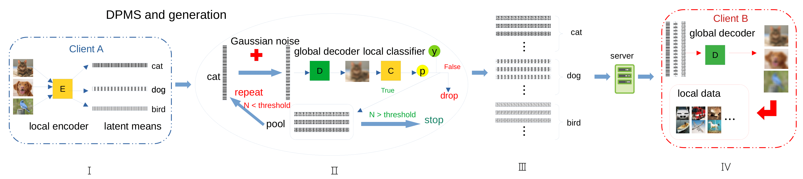
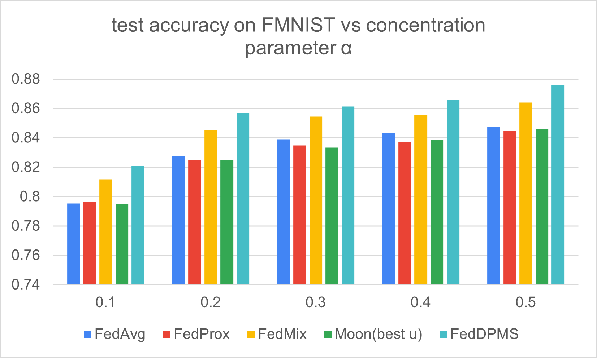
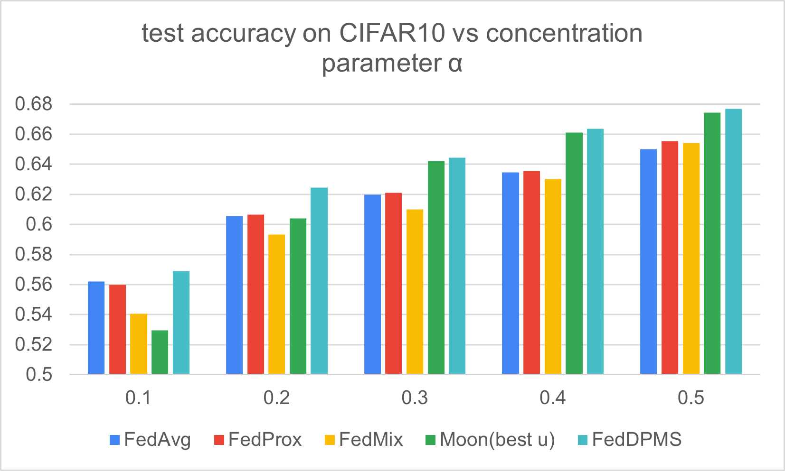
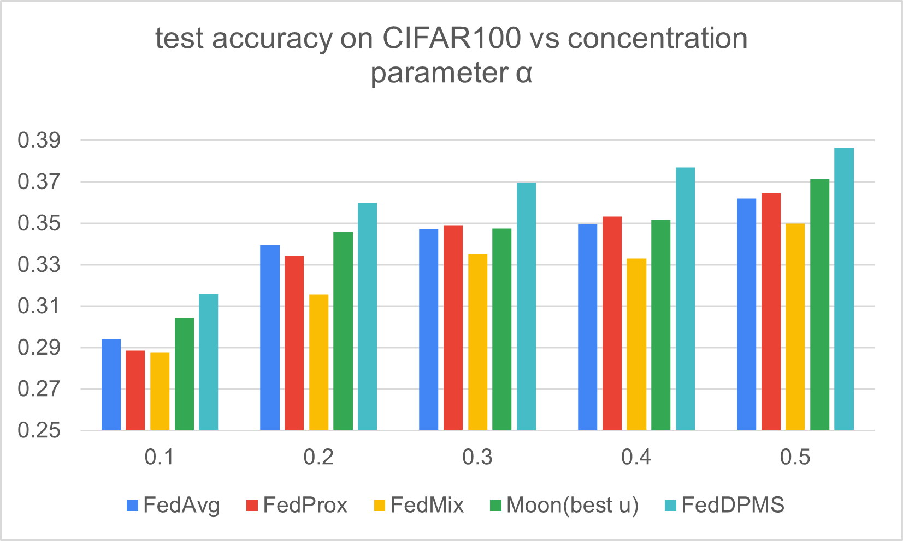
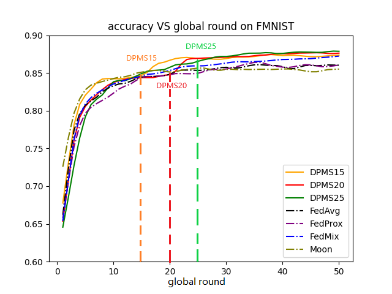
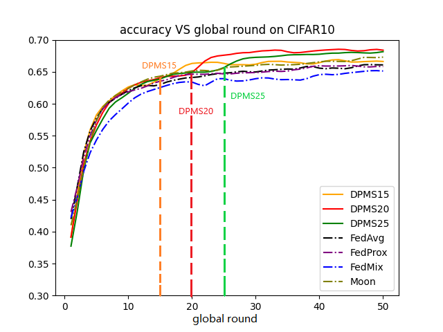

# Federated Hyper Knowledge Distillation
This is an official repository for our CVPR2023 workshop paper
* "[The Best of Both Worlds Accurate Global and Personalized Models through Federated Learning with Data-Free Hyper-Knowledge Distillation](https://citychan.github.io/assets/publications/2023_cvpr/paper.pdf)"


<div align='center'>
</img>
</div>
<br />

### Environment 
This project is developed based on python 3.6 with [torch1.9 (rocm4.2)](https://pytorch.org/get-started/previous-versions/). We use [conda](https://www.anaconda.com/docs/main) to manage the virtual environment.
```
git clone git@github.com:CityChan/Federated-Hyper-Knowledge-Distillation.git
cd Federated-Hyper-Knowledge-Distillation
conda create -n fedhkd --python=3.6
conda activate fedhkd
pip install torch==1.9.1+rocm4.2 torchvision==0.10.1+rocm4.2 torchaudio==0.9.1 -f https://download.pytorch.org/whl/torch_stable.html
pip install -r requirements.txt
```

#### Code Instructions: 
#### Environment 
Python3.6  

We used pipreqs to generate the requirements.txt, thus we have the minimal packages needed.  

#### Code structure 
* train.py //For training and evaluating the model 
* models.py //Our VAEs model for FMNIST, CIFAR10/100
* sampling.py // functions that generate non-iid datasets for federated learning
* util.py // define functions that compute accuracy synthesize images and other general functions
* Localupdate.py // define functions for locally updating models with FedAvg, FedProx, Moon, FedMix and FedDPMS

#### Parameters
* --dataset: 'CIFAR10', 'CIFAR100', 'FMNIST'
* --batch_size: 64 by defalut 
* --num_epochs: number of global rounds, 50 by defalut
* --lr: learning rate, 0.001 by defalut
* --lr_sh_rate: period of learning rate decay, 10 by defalut
* --dropout_rate: drop out rate for each layer, 0.2 by defalut
* --tag: 'centralized', 'federated'
* --num_users: number of clients, 10 by defalut
* --update_frac: proportion of clients send updates per round, 1 by defalut
* --local_ep: local epoch, 5 by defalut
* --beta: concentration parameter for Dirichlet distribution: 0.5 by defalut
* --seed: random seed(for better reproducting experiments): 0 by defalut
* --mini： use part of samples in the dataset: 1 by defalut
* --moon_mu: hyper-parameter mu for moon algorithm, 5 by defalut
* --moon_temp: temperature for moon algorithm, 0.5 by defalut
* --prox_mu： hyper-parameter mu for prox algorithm, 0.001 by defalut
* --pretrain： number of preliminary rounds, 20 by defalut
* --gen_num: desired generation number for each class, 50 by defalut
* --std: standard deviation by Differential Noise, 4 by defalut
* --code_len: length of latent vector, 32 by defalut
* --alg: 'FedAvg, FedProx, Moon, FedVAE, DPMS, FedMix'
* --vae_mu: hyper-parameter for FedVAE and FedDPMS: 0.05 by defalut
* --fedmix_lam: lambda for fedmix: 0.05 by defalut
* --eval_only: only ouput the testing accuracy during training and the running time

#### Running the code for training and evaluation
We mainly use a .sh files to execute multiple expriements in parallel. 
The exprimenets are saved in checkpoint with unique id. Also, when the dataset is downloaded for the first time it takes a while. 

example: 

(1) for training a DPMS model   
```
python3 train.py --dataset 'CIFAR100' --batch_size 64 --lr 0.001 --num_epochs 50 --dropout_rate 0.2 --tag 'federated' --num_users 10 --update_frac 1 --local_ep 5 --beta 0.5 --seed 0 --mini 1 --pretrain 20 --gen_num 50 --std 4 --code_len 128 --alg 'DPMS' --vae_mu 0.05
```

(2) for test the trained and saved model   
```
python3 train.py --dataset 'CIFAR100' --batch_size 64 --lr 0.001 --num_epochs 50 --dropout_rate 0.2 --tag 'federated' --num_users 10 --update_frac 1 --local_ep 5 --beta 0.5 --seed 0 --mini 1 --pretrain 20 --gen_num 50 --std 4 --code_len 128 --alg 'DPMS' --vae_mu 0.05 --eval_only
```

You can explore the different .sh files in the 'scripts' folder for more examples.

####  Visualization of experiment results
<div align='center'>
</img>
</div>
<br />
<div align='center'>
</img>
</div>
<br />
<div align='center'>
</img>
</div>
<br />
<div align='center'>
</img>
</div>
<br />
<div align='center'>
</img>
</div>
<br />
<div align='center'>
</img>
</div>
<br />

#### Citation
We appreciate your citation if you use this codebase.
```
@article{chen2022federated,
  title={Federated Learning in Non-IID Settings Aided by Differentially Private Synthetic Data},
  author={Chen, Huancheng and Vikalo, Haris},
  journal={arXiv preprint arXiv:2206.00686},
  year={2022}
}
```
